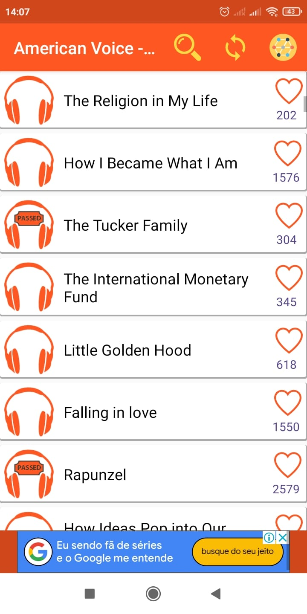

# English Listening Step by Step

TLDR (Resumo): Um aplicativo para ouvir áudios variados em inglês.

# Como funciona?
Habilidades que podem ser praticadas:

 - Listening

O English Listening Step by Step funciona por meio de categorias de áudios. Estas categorias dividem os áudios em níveis, por exemplo, A1, A2, B2, etc. Além disso, existem categorias que dividem os áudios em temas como negócios e ciências. Por fim, é possível também ouvir áudios com vozes de pessoas americanas ou britânicas. 

## Quanto tempo eu deveria passar nele?

O aplicativo pode ser usado por qualquer tempo desejado. Eu particularmente recomendaria ouvir um áudio por dia no mínimo. Ouvir áudios demais talvez não seja produtivo em razão de receber muito vocabulário ao mesmo tempo e não lembrar do conteúdo dos áudios depois.

## Screenshot

<table>
  <tr>
    <td align="center">
      <a href="#">
         
      </a>
    </td>
    <td align="center">
      <a href="#">
         
      </a>
    </td>
    <td align="center">
      <a href="#">
         
      </a>
    </td>
</table>

## Onde baixar?

- [English Listening Step by Step Android](https://play.google.com/store/apps/details?id=com.ocoder.learn.english.free&hl=pt_BR&gl=US)
- [English Listening Step by Step IOS](https://apps.apple.com/us/app/english-listening-step-by-step/id1527768897)
