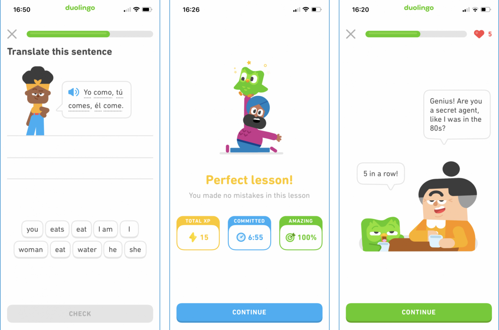

# Duolingo

TLDR (Resumo): Um aplicativo gratuito reconhecido internacionalmente e usado por milhões de pessoas para aprender um novo idioma, inclusive o inglês.

# Como funciona?
Habilidades que podem ser praticadas:

 - Speaking
 - Listening
 - Writing
 - Reading

O Duolingo usa conceitos de gamificação, isto é, traz mecanismos de jogos para tornar o aprendizado atrativo e interessante. Além disso, é possível seguir amigos para acompanhar o progresso deles no idioma-alvo. Por fim, para tornar tudo mais competitivo, há rankings de estudo de usuários por meio de divisões. Exemplificando: usuários que estudam por mais tempo estariam em uma divisão mais alta que outros que estudam menos. 

## Quanto tempo eu deveria passar nele?

Depende. Muitas pessoas usam o Duolingo por cinco minutos por dia. Outras, por 10 ou 15 minutos. Quem deve decidir o tempo dedicado é você de acordo com a sua rotina e disponibilidade. Mas lembre que qualquer quantidade de tempo a partir de 5 minutos é muito válida e com constância contribui demais para evoluir no aprendizado do idioma.

## Screenshots

## Onde baixar?

- [Duolingo Android](https://play.google.com/store/apps/details?id=com.duolingo&hl=pt_BR&gl=US)
- [Duolingo IOS](https://apps.apple.com/br/app/duolingo/id570060128)
- [Duolingo Web](https://pt.duolingo.com/)

