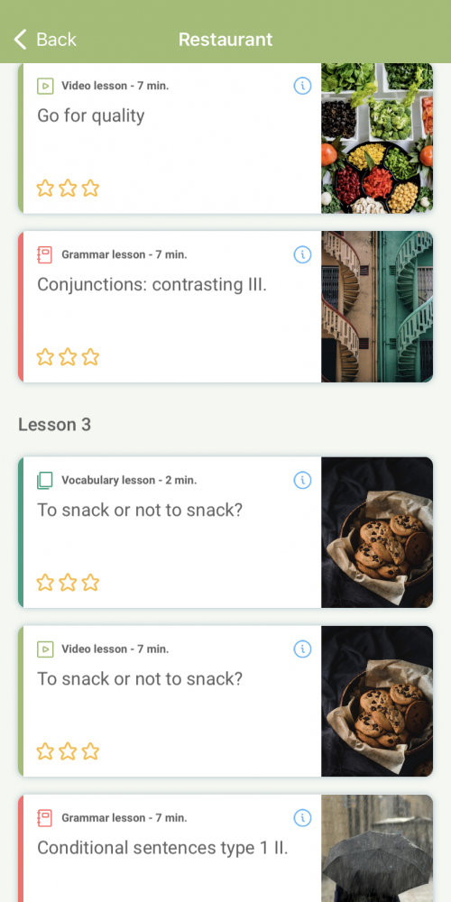

# Xeropan

TLDR (Resumo): Um aplicativo de aprendizado de idiomas freemium premiado pela EdTech Breakthrough 2020. 

# Como funciona?
Habilidades que podem ser praticadas:

 - Speaking
 - Listening
 - Reading

O Xeropan usa conceitos de gamificação, isto é, traz mecanismos de jogos para tornar o aprendizado atrativo e interessante assim como o Duolingo. Nele também é possível seguir amigos para acompanhar o progresso deles no idioma-alvo. O diferencial dele em comparação com o Duolingo é que ele divide o aprendizado de um mesmo tema em etapas. Exemplificando, digamos que você está aprendendo sobre carros dentro de uma unidade, primeiro você passará por uma lição de vocabulário, então terá uma lição de speaking e por fim verá um vídeo com transcrição sendo capaz de praticar o listening e o reading. Assim, você tem um aprendizado completo do tema carros tendo colocado em prática quase todas as habilidades possíveis, exceto o writing.

## Quanto tempo eu deveria passar nele?

O aplicativo na versão gratuita só permite o uso por cinco minutos. No entanto, eu acredito que vale muito a pena usá-lo, mesmo que o tempo seja curto. Se você tiver uma condição financeira legal, pode assinar a versão premium que te dá acesso ao app pelo tempo que quiser e libera diversas funcionalidades extras.

## Screenshot

## Onde baixar?

- [Xeropan Android](https://play.google.com/store/apps/details?id=com.application.xeropan)
- [Xeropan IOS](https://apps.apple.com/br/app/xeropan-aprenda-idiomas/id899256917)
