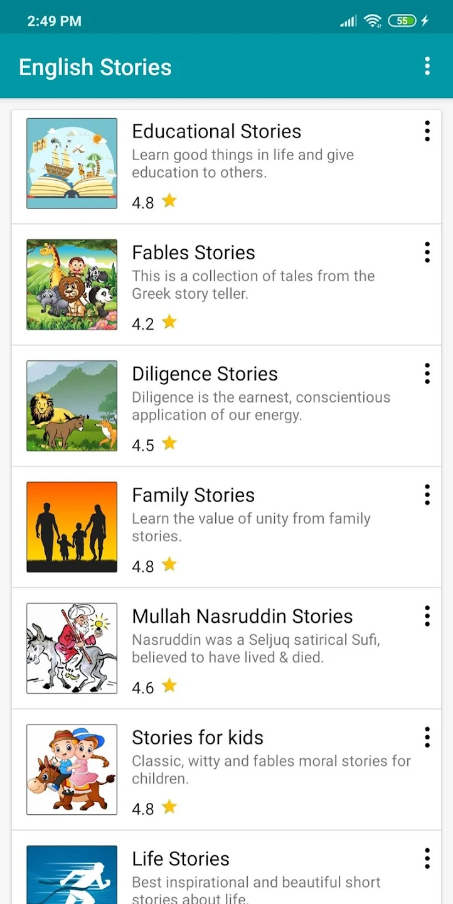
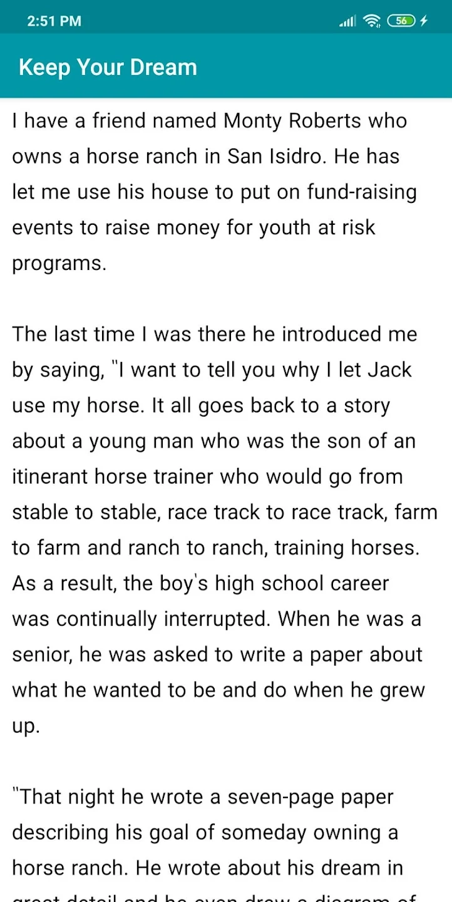

# English Stories (Offline)

TLDR (Resumo): Um aplicativo para leitura de histórias curtas em inglês.

# Como funciona?
Habilidades que podem ser praticadas:

 - Reading

O English Stories (Offline) funciona por meio de categorias de histórias em inglês que você pode acessar e ler sem acesso à internet. Algumas categorias existentes são: histórias motivacionais, histórias sobre família e histórias educacionais. É possível adquirir bastante vocabulário lendo apenas uma história por dia. 

## Quanto tempo eu deveria passar nele?

O aplicativo pode ser usado por qualquer tempo desejado. Eu particularmente recomendaria cinco minutos ou de uma a duas histórias por dia. 

## Screenshots

<table>
  <tr>
    <td align="center">
      <a href="#">
         
      </a>
    </td>
    <td align="center">
      <a href="#">
         
      </a>
    </td>
</table>

## Onde baixar?

[English Stories Offline Android](https://play.google.com/store/apps/details?id=story.english.stories&hl=pt_BR&gl=US)
