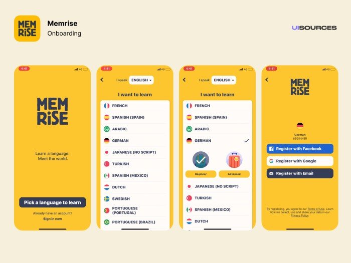

# Memrise

TLDR (Resumo): O Memrise é uma plataforma britânica web de ensino de idiomas que usa repetição espaçada de flashcards para aumentar a taxa de aprendizado.

# Como funciona?
Habilidades que podem ser praticadas:

 - Vocabulary
 -  Listening

O Memrise funciona por meio de cursos de um idioma. Tais cursos possuem flashcards de palavras do idioma selecionado. Flashcards são basicamente um cartão que contém uma imagem na frente e uma descrição atrás ou o contrário. A técnica de flashcards consiste em utilizar a repetição espaçada de palavras para ajudar na memorização. O Memrise é incrível para ganhar novo vocabulário. Na minha opinião, os melhores cursos de idiomas são os criados pela próprio Memrise. Nesse sentido, existem cursos alternativos criados pelos próprios usuários do Memrise para aprendizado de temas específicos.

## Quanto tempo eu deveria passar nele?

Isso vai depender muito. Mas se você está precisando bastante de uma melhora no seu vocabulário de inglês, recomendo usá-lo de 15 a 30 minutos por dia.

## Screenshots

## Onde baixar?

- [Memrise Web](https://www.memrise.com/pt-br/)
- [Memrise Android](https://play.google.com/store/apps/details?id=com.memrise.android.memrisecompanion&hl=pt_BR&gl=US)
- [Memrise IOS](https://apps.apple.com/br/app/memrise-fale-um-novo-idioma/id635966718)
