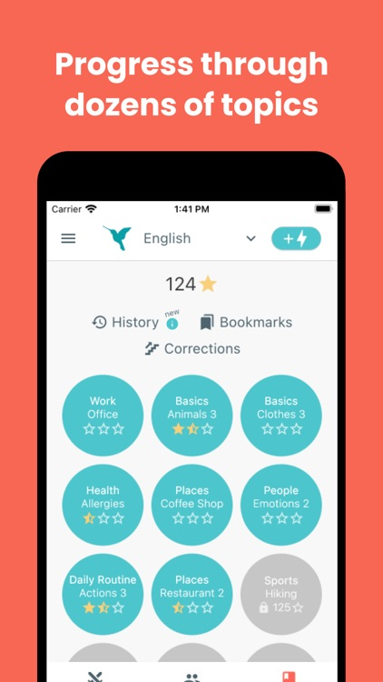
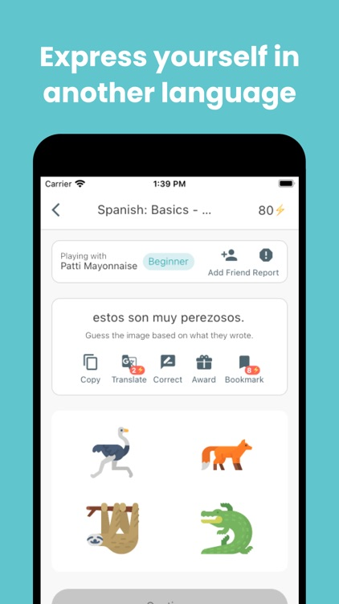

# Polygloss

TLDR (Resumo): Um aplicativo gamificado para nível intermediário. É feito para praticar vocabulário por meio de construção de frases descritivas.

# Como funciona?
Habilidades que podem ser praticadas:

 - Writing
 -  Speaking (Versão premium)

A ideia do Polygloss (que por sinal é genial) é jogar partidas com parceiros que estudam o mesmo idioma. A partida consiste em uma dinâmica de advinhação que usa quatro imagens relacionadas a algum tema. Ficou confuso né? Vou explicar melhor, digamos que você queira aprender sobre cozinha, existe uma unidade no aplicativo sobre esse tema, você inicia uma partida, então terão quatro imagens sobre cozinha na sua frente, descreva uma delas no idioma que você está aprendendo de forma que o seu parceiro possa adivinhar a correta. No round seguinte, você deverá ler a descrição do seu parceiro para outra imagem no contexto de cozinha e acertá-la. Pronto, esse é um resumo de como a dinâmica funciona. A cada partida bem-sucedida, você e seu parceiro ganham pontos e você desbloqueará mais temas para escrever sobre.

## Quanto tempo eu deveria passar nele?

O aplicativo pode ser usado por qualquer tempo desejado. Tudo vai depender de quanto tempo você vai querer passar praticando, por exemplo, você poderia praticar somente se há alguma palavra ou frase específica nova que você deseja colocar em prática para fixar na memória.

## Screenshots

<table>
  <tr>
    <td align="center">
      <a href="#">
         
      </a>
    </td>
    <td align="center">
      <a href="#">
         
      </a>
    </td>
</table>

## Onde baixar?

- [Polygloss Android](https://play.google.com/store/apps/details?id=app.polygloss.polygloss_app&hl=pt_BR&gl=US)
- [Polygloss IOS](https://apps.apple.com/br/app/polygloss/id1536428473)

